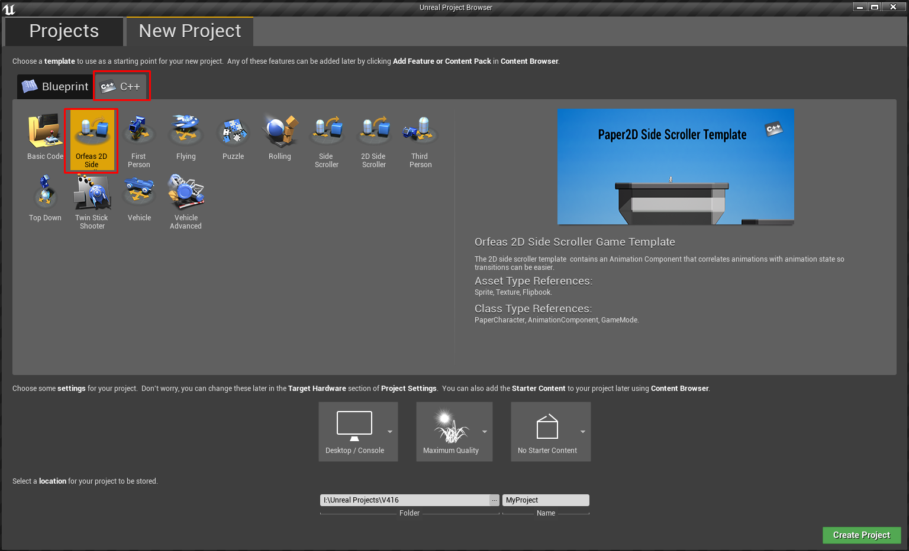

# Orfeas Paper 2D UE4 Template

Extended Paper 2D template for Unreal Engine 4. Contains an animation component that makes the transition of animations easier.
To add the project in your engine, copy and paste the Orfeas_Paper2D_UE4_Template folder inside [YourEngineVersion]/Templates.
Then, go in the C++ project tab in your engine and select the following new option:

Current version: 4.16
You must restart the editor in order for the project to become available.